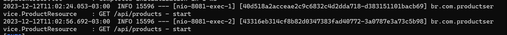
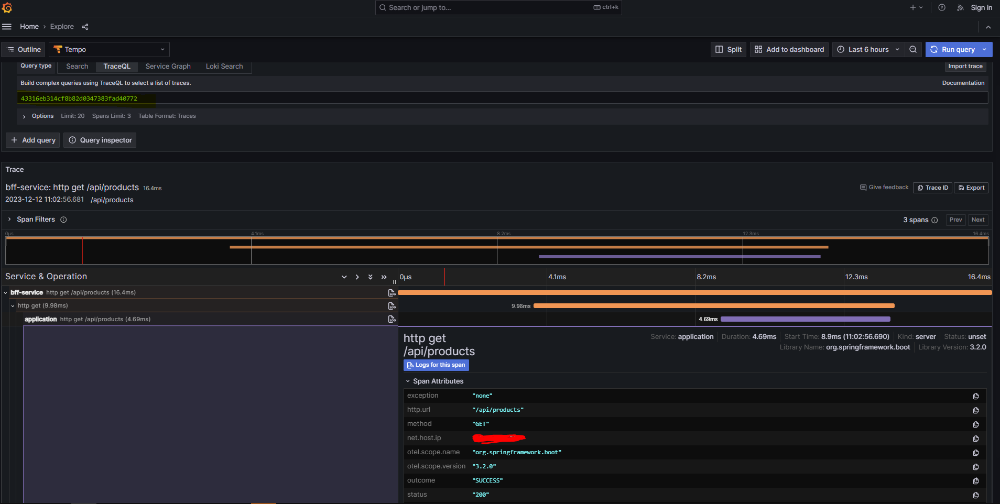

# Observability with Spring Boot 3

This is a sample project to demonstrate how to use Spring Boot 3 with
Micrometer, Prometheus, Grafana, Loki e Tempo.


## Requirements

* Java 17
* Spring Boot 3.0 or higher:
  * Spring WEB or Reactive
  * Spring Actuator
  * Spring AOP
  * Logback (or Log4j2)
* Docker/Compose

## Observability Stack

* **Micrometer**:  metrics collection library
* **Tempo**:  distributed tracing backend
* **Loki**:  log aggregation system
* **Grafana**:  visualization tool for metrics, logs and traces
* **Prometheus**:  monitoring platform that collects metrics from monitored targets by scraping metrics HTTP endpoints on these targets

## Running the project

To run the project, just execute:

```shell
docker-compose up -d
```

This will start the following services:
```shell
$ ./mvnw spring-boot:run -pl :bff-service
```
```shell
$ ./mvnw spring-boot:run -pl :product-service
```

## Testing the project

```shell
  curl --location 'http://localhost:8080/api/products'
```

**Grafana Dashboards** : http://localhost:3000/

**Application log** : 


**Tempo** :


**Loki** :
